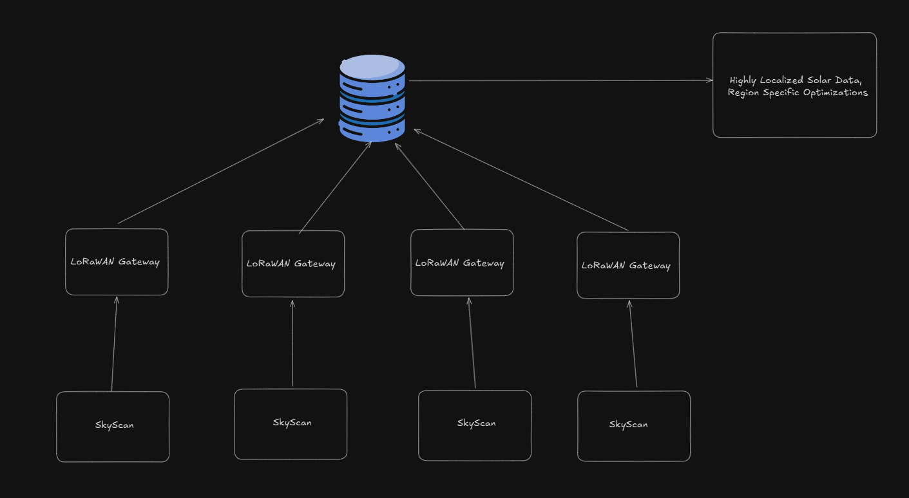

# FP-F24 IoT Venture Pitch
## ESE5180: IoT Wireless, Security, & Scaling

## 1 GitHub URL

[\[Insert your GitHub URL here.\]](https://github.com/ese5180/fp-f24-iot-venture-pitch-solar)

## 2 Team Selection

Team Name: SkyScan

| Team Member Name | Email Address       |
|------------------|---------------------|
| Chris Connolly   | cconnol@seas.upenn.edu          |
| Ahmed Abdellah     | abdellah@seas.upenn.edu          |
| Melanie Herbert        | mherbert@seas.upenn.edu |

When will you have your 30-minute weekly team meeting? Wednesday 8pm.

## 3 Reading & Research

Nothing to submit for this section!

## 4 Concept Development

### 4.1 Target Market & Demographics

The target market for SkyScan consists of grid operators and solar energy investors, two groups heavily involved in the evolving energy landscape. With the Energy and Utility Analytics Market valued at USD 3.07 billion in 2023 and projected to reach USD 10.41 billion by 2031, growing at a CAGR of 16.5%, there is a demand for high-quality data to optimize grid performance and support investment decisions. Additionally, solar technology investment is expected to exceed USD 500 billion by 2031, underscoring a clear appetite for reliable, data-driven insights into solar energy performance.

Both of these markets face a common, critical gap: a lack of granular, localized data. Existing data solutions often cover broad regions, failing to capture the significant variances in solar production that can occur even over short distances. SkyScan addresses this need by providing hyper-local data from rooftop mounts capable of gathering solar irradiance, temperature, and power output metrics at the individual building level. This level of precision empowers grid operators to optimize resource allocation and enhances investors' ability to assess project viability based on highly specific data.

By offering a robust API for real-time alerts and monitoring, along with predictive insights for solar output forecasting, SkyScan brings a new level of accuracy and customization to solar energy data, enabling smarter decisions in a world increasingly driven by geographically distributed energy solutions.

### 4.2 Security Requirements

Because we are gathering massive amounts of data about weather / enviroment, we do not need to worry about the confidentiality of our messages. However, we must still care about the authentication and integrity of wireless transmissions.  

* We shall ensure that devices connecting to LoRa gateways are our certified devices, thus guaranteeing authenticity.
* We shall use checksums and acknowledgements to ensure the integrity of messages. 
* We shall use an enclouser that cannot be easily opened physically for side channel attacks. 
* We shall keep important data in a secure program layer so it cannot be tampered with by message injections

### 4.3 Hardware Requirements Specification

1. Dual-Axis Sun-Tracking System
    * Micro-Actuators
        * The product shall use micro or linear actuators to adjust each mini solar panel’s orientation.
        * The product shall support dual-axis movement (horizontal and vertical) to optimize solar exposure.
        * The product shall allow each actuator to make fine adjustments within ±1° of the desired angle for accurate sun-tracking.
        * The product shall not require external manual adjustments once installed.
    * Rotational Bearings and Mounting Joints
        * The product shall include rotational bearings and joints designed for dual-axis movement to reduce friction and enable smooth positioning adjustments.
        * The product shall use corrosion-resistant materials for durability under outdoor conditions. 
        * The product shall ensure that bearings and joints are rated for the weight of the panels and repeated movement cycles.
        * The product shall not include plastic bearings that may degrade in UV or high-temperature conditions.
    * Sun Position Sensors (Photodiodes or Light Dependent Resistors)
        * The product shall use an array of light sensors in a quadrant configuration to measure light intensity and determine optimal panel positioning.
        * The product shall provide high-sensitivity light sensors with real-time response to changing sunlight angles.
        * The product shall protect all sensors with weatherproof, UV-stabilized enclosures to prevent environmental damage.
        * The product shall not require recalibration of light sensors more than once a year.
2. Control Unit 
    * ATSAMD21G18A Microcontroller (Integrated in SAMD21 Pro RF LoRa Module)
        * The product shall use the ATSAMD21G18A microcontroller to handle all control, data collection, and communication tasks.
        * The product shall support dual-axis sun-tracking control by managing input from sun position sensors and adjusting actuator positioning in real-time.
        * The product shall allow sensor data (temperature, cloud coverage, solar irradiance) to be collected, processed, and stored locally before transmission.
        * The product shall facilitate packet formation for data transmission over LoRa, ensuring reliable communication of collected data to the centralized server.
        * The product shall not require an additional microcontroller for routine data logging, actuator control, or packet formation tasks, keeping the hardware compact and power-efficient.
    * Peripheral and Sensor Management
        * The product shall interface with various peripherals (un position sensors, cloud coverage sensors, temperature sensors, actuators) via the ATSAMD21G18A’s GPIO, I2C, SPI, and UART interfaces.
        * The product shall manage each sensor and actuator with minimal latency, ensuring prompt sun-tracking adjustments and accurate environmental data collection.
        * The product shall not allow direct external access to peripheral control without authorization, maintaining security and operational integrity.
3. Cloud Coverage and Temperature Sensors
    * Cloud Coverage Sensor
        * The product shall use an optical or infrared sensor to measure cloud density and type around the rooftop mount.
        * The product shall log cloud coverage data at a resolution of one data point per minute, correlated with power output metrics.
        * The product shall not require user calibration for cloud coverage sensors more than once per year.
    * Temperature Sensor
        * The product shall include high-sensitivity temperature sensors on the mount to capture ambient and panel surface temperatures.
        * The product shall log temperature data every minute, which will be used for analytics on performance and environmental impact.
        * The product shall not require recalibration of temperature sensors more than once every year.
4. Data Collection and Transmission
    * Data Storage and API Access
        * The product shall log all performance data locally on a microcontroller or onboard storage for redundancy.
        * The product shall synchronize data from local storage to a remote database through periodic batch uploads, using the SAMD21 Pro RF LoRa module to minimize energy consumption.
        * The product shall enable users to access data through a REST API for real-time monitoring, alert configuration, and performance analytics.
        * The product shall not allow direct external modification of logged data, ensuring data integrity for all stored metrics.
    * Database Integration
        * The product shall transmit all collected data to a centralized, cloud-based database designed to store, process, and analyze solar energy and environmental metrics.
        * The product shall include time-stamped records for each data point to enable chronological performance analysis and A/B testing comparisons.
        * The product shall support automated alerts based on predefined triggers, such as reduced energy output or temperature fluctuations.
        * The product shall not require physical data collection (e.g., USB transfer) under standard operating conditions.
5. Power Supply and Energy Management
    * Solar-Powered Battery Backup
        * The product shall include a battery backup charged by surplus energy from the panels, ensuring continuous operation during low-light periods.
        * The product shall implement an energy management system prioritizing data logging and transmission in low-power situations.
        * The product shall not require external charging inputs outside of its self-sustaining power system.

### 4.4 Software Requirements Specification

1. Data Capture
    * The microcontroller should take current measurements at a constant interval with a tolerance of +/- 5% of the given time interval
    * Time intervals for data collection shall be dynamic and this time interval value can be set and get through LoRa. 
    * Clock for time stamping information shall be accurate with a tolerance of +/- 5 mins

2. Data Relay

    * Data should be accurately and reliably reported without sacrificing power usage.
        * Transmission should require acknowledgements
        * A flag should be raised if the acknowledgement is not received within 5 messages sent
            * If calculable, this flag should be raised if there’s a 90% chance the device has disconnected and not that there has been a faulty transmission(s).
    * If data cannot be relayed, it shall be stored in memory until it can send it. If memory runs out, the device shall count how many entries it misses. If, for some reason this counter overflows, a flag should be set. 

3. Device Actuators
    * The operation of an actuator shall not interfere with any concurring data acquisition
    * Device actuation runs on a set schedule or is commanded to run by user through LoRa message
        * This schedule shall be changeable through LoRa messages as well

### 4.4 System Level Diagrams
#### Device Block Diagram

#### System Block Diagram

### 4.5 Budgeting

*30 sec/min" value is an assumption I made to represent a hypothetical scenario where the microcontroller is actively processing data or controlling peripherals for half of each minute (30 seconds) and then in a sleep mode for the other half (30 seconds). This assumption is a common approach in power estimation when we expect periodic or scheduled tasks that don't require continuous active processing.

| Component | Current (Active) | Current (Active) | Duration (Active) | Duration (Sleep) |
|------------------|---------------------| ------------------|---------------------|------------------|
| Microcontroller   | 3.5 mA          |            0.7 µA |      0 sec/min     | 30 sec/min |
| LoRa Module (Transmit/Receive)    | 40 mA (Tx)       |      0.7 µA |      2 sec/5 min | 298 sec/5 min |
| Dual-Axis Actuators| 60 mA        | negligible         |5 sec/5 min |  295 sec/5 min |
| Sun Position Sensors | 5 mA | negligible | 60 sec/min | 0 sec/min | 
|Cloud Coverage Sensor|10 mA|negligible|60 sec/min|0 sec/min|
|Temperature Sensor|1 mA|negligible|60 sec/min |0 sec/min |

Component
Current (Active)40 mA (Tx)
Current (Sleep)
Duration (Active)
Duration (Sleep)
Microcontroller
3.5 mA
0.7 µA
30 sec/min
30 sec/min

LoRa Module (Transmit/Receive)
40 mA (Tx)
1 µA
2 sec/5 min
298 sec/5 min
Dual-Axis Actuators
60 mA
negligible
5 sec/5 min
295 sec/5 min
Sun Position Sensors
5 mA
negligible
60 sec/min
0 sec/min

Cloud Coverage Sensor
10 mA
negligible
60 sec/min
0 sec/min

Temperature Sensor
1 mA
negligible
60 sec/min
0 sec/min

Average current consumption by taking a weighted average of active and idle currents for each component:

Microcontroller component: 

Active current: 3.5mA x 30 sec/60 sec = 1.75 mA
Sleep current: 0.0007 mA x 30sec/60 sec = 0.00035 mA
Average: 1.75 + 0.00035 = 1.75035 mA

LoRa: 0.26766 mA
Dual Axis: 1.0mA
Sun Position Sensors: 5.0mA
Cloud Coverage Sensor: 10.0mA
Temp Sensor: 1.0mA

Battery Life (hours)=Total Average Current Draw (mA)/Battery Capacity (mAh)​
= 3000 mAh / 18.59mA = 161.4 hours

#### Hardware costs

| Component | Current (Active) | 
|------------------|---------------------| 
| Microcontroller   | $11.00        | 
| LoRa Module (Transmit/Receive)        | $19.90          |
| Dual-Axis Actuators        | $10/acutuator         |
| Sun Position Sensors       | $12 |
| Solar Panel | $2.88  |
| Cloud Coverage Sensor | Less common https://www.scopedome.com/?page_id=4770&lang=en |
| Temperature Sensor | $5 |

Enclosure and Weatherproofing:Cost: $10 to $20 per unit.
This covers the cost of a weatherproof and UV-stabilized enclosure to protect the sensors and electronic components.

Software costs

For SkyScan, the choice of leveraging a paid wireless network largely depends on the deployment scale and connectivity requirements. Since SkyScan relies on real-time data transmission and remote monitoring, using a LoRa-based wireless network is an ideal choice due to its low-power, long-range communication capabilities.

The primary advantage of using LoRaWAN is that it operates on unlicensed frequency bands, which significantly reduces costs compared to cellular networks. However, it requires setting up and maintaining gateways to ensure robust coverage over large areas. In cases where SkyScan is deployed in urban or industrial zones, leveraging existing paid networks or shared LoRaWAN networks offered by third-party providers might be beneficial to avoid upfront infrastructure costs.

For larger-scale deployments or where coverage needs exceed the LoRa network’s reach, considering a paid cellular or LTE-M network may become necessary

Role of AI/ML for advancing our forecast predictions:

OpenAI’s models can analyze patterns in historical solar irradiance, temperature, and cloud coverage data to forecast future energy output more accurately than traditional statistical models. Leveraging machine learning models for time-series forecasting can provide insights into energy production trends based on varying environmental factors.
Anomaly Detection:

Implementing AI models allows you to set up anomaly detection systems. For example, sudden drops in output or temperature fluctuations can be flagged, leading to proactive maintenance or adjustments in the sun-tracking system.
Dynamic Recommendations:

Based on forecasts, AI models can suggest optimal tilt and orientation adjustments for the dual-axis system, improving overall energy capture efficiency. Additionally, if paired with real-time pricing data, models could help determine optimal times for energy export or storage, enhancing economic returns.

## 5 In-Class Pitch

Your 7-minute pitch must include:

* Target Market & Demographics
* System block diagram

If you plan to use slides, photos, or video content, you must add it to 
[this Google Slides presentation](https://docs.google.com/presentation/d/1y8u7Vnv6UbQW1ZJE-_bTKOHY9EkHA-aqm6LmBllAFdA/edit#slide=id.p1).

## MEMFAULT FLEET MANAGEMENT ASSIGNMENT 

1) Memfault SDK is set up on at least two devices
Device #1:

Uploaded wifi code to nrf7002DK

Device #2:

1) Core dump

3) Forward at least one piece of critical device information to Memfault’s cloud

5) Extra Credit: A/B testing, staged rollout, battery/power tracking, or other feature approved by the teaching team